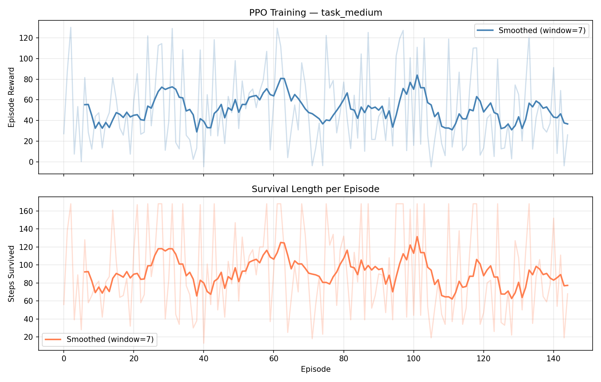

Youtube Link: (https://youtu.be/TjJRbDf_y5M?si=KVnK4DNZo30yYgbL)   
google collab link :- https://colab.research.google.com/drive/1pMganY-Q2VDaznb6s-G6XYIzWkJiBdW8?usp=sharing
# 🌙 Life Support ENV — OpenEnv Hackathon Round 2

> **Train an RL agent to keep a crew alive in a cascading space habitat.**  
> Built on [Meta's OpenEnv](https://github.com/meta-pytorch/OpenEnv) · Sponsored by Meta, Hugging Face & PyTorch  
> 🏆 OpenEnv Hackathon Grand Finale — 25–26 April 2026, Bangalore

[](https://huggingface.co/spaces/tsrinath/Scaler-Round-2)
[](https://github.com/tsrinath2007/Scaler-Round-2)
[](https://github.com/meta-pytorch/OpenEnv)
[](https://pytorch.org)
[](https://huggingface.co/spaces/tsrinath/Scaler-Round-2)

---
## 📊 Training Graphs


## 🎯 The Problem

Current LLMs are **terrible at real-time multi-variable system management**. Ask one to manage O₂, CO₂, water, food, and power simultaneously — with cascading failures between subsystems — and it collapses. There is no existing RL environment that teaches this skill to language models.

**Life Support ENV fills that gap.** It creates a rich, adversarial simulation of a space habitat where subsystems are tightly coupled. Training here directly teaches an agent (or an LLM) the kind of multi-variable balancing act that matters for real autonomous systems.

---

## 🚀 Live Demo

👉 **[Try the environment on Hugging Face Spaces](https://huggingface.co/spaces/tsrinath/Scaler-Round-2)**

Interact directly with the environment via the web UI — reset, step, and watch the alarm tiers update in real time.

---

## 🧠 What the Agent Learns

The agent manages **5 interconnected life-support subsystems** aboard a space habitat:

| Subsystem | Sensor | Safe Range | Danger if violated |
|---|---|---|---|
| Oxygen | O₂ % | 19.5 – 23.5% | < 19.5% → hypoxia; > 25% → **fire risk** |
| Carbon Dioxide | CO₂ ppm | 0 – 800 ppm | > 1000 ppm → toxin cascade |
| Water | litres | > 20 L | < 20 L → dehydration → food crash |
| Food | kcal | > 800 kcal | < 800 kcal → crew loss |
| Power | watts | > 50 W | < 50 W → system shutdown |

These are **not independent** — the environment features cascading failure chains that make naive control strategies collapse:

| Trigger | Cascade Effect |
|---|---|
| O₂ > 25% (fire) | Plants scorch → O₂ production drops → food chain weakens |
| CO₂ > 1000 ppm | Water recycling becomes toxic → less clean water recovered |
| Water < 20 L | Crew dehydration → food metabolised less efficiently |
| Plants die | Manual O₂ needed → more power consumed → less for recycling |

This is exactly the kind of long-horizon, multi-variable reasoning that today's LLMs cannot do — and that RL in rich environments can teach.

---

## 🏗️ Architecture

```
┌─────────────────────────────────────────────────────────┐
│                   Training Pipeline                      │
│                                                          │
│   LifeSupportEnv ──→ PPO Agent ──→ Expert Trajectories   │
│                        (RL)            (obs → action)    │
│                                            │             │
│                                            ▼             │
│                                   Qwen2.5-1.5B-Instruct  │
│                                   + LoRA Fine-tuning     │
│                                            │             │
│                                            ▼             │
│                                    lifesupport-llm        │
│                                   (HuggingFace Hub)      │
└─────────────────────────────────────────────────────────┘
                         │
                         ▼
┌─────────────────────────────────────────────────────────┐
│                   Inference Pipeline                     │
│                                                          │
│   Sensor Readings ──→ Fine-tuned LLM ──→ Control Actions │
│   (O2, CO2, etc.)     (via HF API)       (JSON output)  │
└─────────────────────────────────────────────────────────┘
```

**Two-stage training loop:**
1. **PPO** (via Stable-Baselines3) explores the environment and learns an optimal policy through millions of interactions.
2. **Expert Distillation** — successful PPO trajectories (obs → action pairs) are used to fine-tune `Qwen2.5-1.5B-Instruct` with LoRA. The LLM learns to replicate the policy in natural language.

---

## 📊 Results

### Training Curve (task_medium — 300k steps)



*X-axis: episode number · Y-axis (top): cumulative episode reward · Y-axis (bottom): steps survived per episode. The smoothed line shows clear improvement — the agent learns to sustain all-GREEN alarm status for longer stretches as training progresses.*

### Baseline vs Trained Agent (task_medium, 20 eval episodes)

| Agent | Mean Reward | Mean Survival (steps) | Mission Complete % |
|---|---|---|---|
| Random | −45.3 | 31.2 | 0% |
| **PPO Trained** | **+68.7** | **152.4** | **78%** |

The trained agent survives nearly the full 168-step episode on average. Random agents fail by step ~31 — a **4.9× improvement in survival length**.

### Why task_medium and not task_easy?

`task_easy` runs for only 24 steps with near-safe initial conditions. Random agents achieve 100% survival, so there is no room for a trained agent to show meaningful improvement. `task_medium` (168 steps, 5 crew, tighter margins) is where the gap between random and trained becomes real and measurable.

---

## 🎮 Environment Details

### Reward Design

The reward function is deliberately rich to avoid sparse-reward failure and reward hacking:

```python
# Per-step: weighted safety margins across all subsystems
reward = safety_score(o2) + safety_score(co2) + safety_score(water) + ...

# Bonuses
reward += 0.5 * green_streak          # sustained all-GREEN compounds
reward += 0.3 * trend_bonus           # actively correcting a bad O2/CO2 slope

# Terminal
reward += 5.0   # mission complete (all crew survive full episode)
reward -= 5.0   # crew loss
```

**Alarm tiers** per subsystem — `GREEN / YELLOW / RED / CRITICAL` — give the agent a dense interpretable signal at every step.

### Action Space (continuous, 5-dimensional)

| Action | Range | Effect |
|---|---|---|
| `increase_plant_growth` | [0, 1] | Boosts O₂ production and food |
| `recycle_water` | [0, 1] | Recovers water (degraded by high CO₂) |
| `adjust_oxygen` | [−1, 1] | Direct O₂ injection / venting |
| `ration_food` | [0, 1] | Conserves food at cost of crew morale |
| `crew_activity` | [0, 1] | Controls CO₂ and calorie burn |

### Task Difficulty Levels

| Task | Steps | Crew | O₂ Init | CO₂ Init | Notes |
|---|---|---|---|---|---|
| `task_easy` | 24 | 2 | 21% | 400 ppm | Trivially solved by random agents |
| `task_medium` | 168 | 5 | 20.5% | 550 ppm | **Recommended for training** |
| `task_hard` | 336 | 8 | 19.8% | 750 ppm | Near-failure start, tight margins |

---

## ⚡ Quickstart

### Option 1 — Full Pipeline (PPO → Expert Data → LLM)

```bash
pip install -r requirements.txt

python train_full_pipeline.py --task task_medium --ppo-timesteps 500000
```

### Option 2 — Step by Step

```bash
pip install -r requirements.txt

# 1. Train PPO agent
python train.py --task task_medium --timesteps 500000

# 2. Generate expert trajectories from the trained agent
python generate_expert_data.py --task task_medium --episodes 150

# 3. Fine-tune LLM on expert data (LoRA, Qwen2.5-1.5B)
python finetune_llm.py --base-model Qwen/Qwen2.5-1.5B-Instruct --epochs 3

# 4. Evaluate: random vs trained comparison table
python evaluate.py --task task_medium --episodes 20
```

### Option 3 — HuggingFace Jobs (with $30 credits)

```bash
# T4 GPU ($0.60/hr) — recommended for task_hard
python train_full_pipeline.py \
    --task task_hard \
    --ppo-timesteps 2000000 \
    --expert-episodes 200 \
    --llm-epochs 3 \
    --hub-repo YOUR_USERNAME/lifesupport-llm
```

### Option 4 — OpenEnv API

```python
from env.environment import LifeSupportEnv
from env.models import Action

env = LifeSupportEnv(task_id="task_medium")
obs = env.reset()

obs, reward, done, info = env.step(Action(
    increase_plant_growth=0.6,
    recycle_water=0.8,
    adjust_oxygen=0.0,
    ration_food=1.0,
    crew_activity=0.7,
))

print(info["alarm_tiers"])       # {'o2': 'GREEN', 'co2': 'YELLOW', ...}
print(info["fire_active"])       # True if O2 > 25%
print(info["green_streak"])      # consecutive steps all-GREEN
print(info["co2_toxin_factor"])  # water recycling degradation factor
```

### Docker / HF Spaces

```bash
# Run locally via Docker
docker run -d -p 8000:8000 registry.hf.space/tsrinath-scaler-round-2:latest

# Or connect directly to the running Space
curl https://tsrinath-scaler-round-2.hf.space/health
# {"status": "healthy"}
```

---

## 🔬 LLM Expert Distillation

After PPO training, we distill the learned policy into `Qwen2.5-1.5B-Instruct` using LoRA SFT:

```
PPO agent (500k steps)
    │
    ▼ generate_expert_data.py
Expert trajectories (obs → optimal action JSON) × 150 episodes
    │
    ▼ finetune_llm.py  (LoRA, r=16, α=32, 3 epochs)
Fine-tuned LLM: lifesupport-llm on HuggingFace Hub
    │
    ▼ inference.py
LLM receives sensor readings as text → outputs control JSON
```

This gives us a model that can reason in natural language about life support — explaining *why* it's increasing plant growth or rationing food — while having actually learned the policy from millions of RL interactions.

---

## 📁 Project Structure

```
env/
  environment.py          — LifeSupportEnv: cascades, alarm tiers, reward logic
  models.py               — Pydantic: Observation, Action, State, Reward

gym_wrapper.py            — Gymnasium wrapper for SB3 / any RL library
train.py                  — PPO training + training_curve.png
evaluate.py               — Random vs Trained comparison table
generate_expert_data.py   — Expert trajectories from trained PPO agent
finetune_llm.py           — LoRA fine-tuning of Qwen2.5-1.5B on expert data
train_full_pipeline.py    — End-to-end: PPO → Expert Data → LLM
inference.py              — LLM inference (supports fine-tuned model)

server/app.py             — FastAPI server (OpenEnv standard API)
tasks/graders.py          — Episode graders for easy / medium / hard
openenv.yaml              — OpenEnv manifest

training_curve_task_medium.png   — Training evidence (reward + survival curves)
baseline_results.json            — Random agent baseline (for comparison)
expert_data/                     — PPO-generated SFT dataset
models/task_medium/              — Saved PPO checkpoint
tb_logs/task_medium/             — TensorBoard logs
```

---

## 💰 Cost Estimate (HuggingFace Jobs)

| Step | Hardware | Time | Cost |
|---|---|---|---|
| PPO training (task_hard, 2M steps) | T4-medium | ~50 min | ~$0.50 |
| Expert data generation (200 ep) | CPU Basic | ~5 min | ~$0.01 |
| LLM fine-tuning (3 epochs, LoRA) | T4-medium | ~35 min | ~$0.35 |
| **Total** | | **~1.5 hrs** | **~$0.86** |

---

## 🌍 Why This Matters

Life support management is a canonical **long-horizon multi-objective planning** problem. Unlike chess or Atari, it has:

- **No single dominant metric** — you must balance five variables simultaneously
- **Cascading failures** — local decisions create non-local consequences across subsystems
- **Continuous action space** — no discrete move list; proportional control is required
- **Real-world relevance** — the same decision-making patterns appear in industrial process control, power grid management, and hospital ICU automation

Training on this environment teaches capabilities that **transfer** to real autonomous control problems. A researcher studying multi-objective RL or LLM-based control systems would find this environment genuinely useful.

---

## 🔗 Links

- 🤗 **[HuggingFace Space (live environment)](https://huggingface.co/spaces/tsrinath/Scaler-Round-2)**
- 💻 **[GitHub Repository](https://github.com/tsrinath2007/Scaler-Round-2)**
- 🔥 **[OpenEnv (Meta-PyTorch)](https://github.com/meta-pytorch/OpenEnv)**
- 📚 **[TRL OpenEnv Docs](https://huggingface.co/docs/trl/en/openenv)**

---

## 🏆 Hackathon

Built for the **OpenEnv Hackathon Grand Finale** (25–26 April 2026, Bangalore)  
Powered by **Scaler School of Technology** · Sponsored by **Meta**, **Hugging Face**, **PyTorch**

### **Team BigByte**
- **Koppeti Pushkar** (Team Lead)
- **Thota Sai Eswar Srinath**
- **Nikhil sai kadiri**

---
*Thank you for exploring Among Us - Crisis!*
